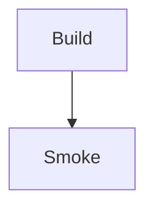

# Dependency Upgrade Implementation Plan

> **For agentic workers:** REQUIRED SUB-SKILL: Use superpowers:subagent-driven-development (recommended) or superpowers:executing-plans to implement this plan task-by-task. Steps use checkbox (`- [ ]`) syntax for tracking.

**Goal:** 更新当前项目依赖，在允许 major 升级和最小兼容适配的前提下，保持 Bun 工具链、VitePress 构建和 `docs/` 屏蔽规则稳定。

**Architecture:** 依赖升级分两批执行：先升级站点运行栈并验证主题、Tailwind、PrimeVue 页面；再升级文档/工具链栈并验证 markdown 数学、Mermaid、Prettier 边界。每批都用 `bun install`、`bun ci`、`bun run docs:build` 作为硬门槛，并在进入下一批前检查 `docs/` 内部文档没有泄漏进产物。

**Tech Stack:** Bun 1.3.12、VitePress 1.6.4、Vue、PrimeVue、PrimeUI themes、Tailwind CSS 4、vitepress-sidebar、vitepress-mermaid-renderer、markdown-it-mathjax3、Prettier。

---

## 文件结构与职责

**预计修改：**

- `package.json`：更新依赖版本；保持 `packageManager`、scripts、`trustedDependencies` 的 Bun 迁移结果不回退。
- `bun.lock`：由 Bun 更新锁文件，保持唯一锁文件基线。

**仅在兼容适配必要时修改：**

- `.vitepress/theme/index.ts`：仅当 `@primeuix/themes` major 破坏现有 import path、`definePreset` 或 PrimeVue theme 配置时做最小适配。
- `.vitepress/theme/GLayout.vue`：仅当 `vitepress-mermaid-renderer` API 变更破坏 `createMermaidRenderer()` 初始化时做最小适配。
- `.vitepress/config.mts`：仅当依赖升级要求最小配置调整时修改；必须保留 `excludePattern` 中的 `docs` 和 `srcExclude` 中的 `docs/**`。
- `.vitepress/theme/style.css`：默认不修改；不得引入旧式 Tailwind config 或重写 CSS 架构。

**不得修改：**

- `README.md`、`CONTRIBUTING.md`：本轮不是文档改口径任务。
- `.github/workflows/deploy.yml`：除非验证发现 Bun CI 入口被破坏，否则保持现状。
- `docs/` 内部规格/计划历史文件：不得让它们进入 VitePress 产物，也不做内容改写。

**临时文件：**

- `__dependency-smoke.md`：仅在 Task 2 用作未提交的数学公式 + Mermaid smoke fixture，验证后必须删除，最终 `git status --short` 中不得残留。

## 全局约束

- 不创建提交，除非主控会话后续得到用户明确提交指令。
- 不主动运行 `bun run format` 或 `prettier --write .`。
- 若必须格式化，只能对本任务实际修改过的文件做定向格式化。
- 如果 `bun outdated` 的版本与本文不同，以执行时输出为准，并在任务结果中记录差异。
- 如果某个计划内依赖不再出现在实施时 `bun outdated` 输出中，跳过该依赖并记录“无需升级”；如果出现 `vitepress`、`vitepress-sidebar`、`primeicons` 或其他计划外依赖，先报告范围变化，不自行扩大升级范围。
- 如果 `markdown-it-mathjax3@5.x` 与当前 `vitepress@1.6.4` peer `^4` 冲突，默认记录单项阻塞或回退该依赖，不扩大到 VitePress 升级。
- 单依赖回退模板：`bun add <package>@<previous-version>` 或 `bun add --dev <package>@<previous-version>`，随后必须重新执行 `bun install`、`bun ci`、`bun run docs:build`，并记录回退版本、失败证据和后续可重试条件。

---

### Task 1: 基线检查与第一批运行栈升级

**Files:**
- Modify: `package.json`
- Modify: `bun.lock`
- Conditional Modify: `.vitepress/theme/index.ts`
- Conditional Modify: `.vitepress/theme/style.css`
- Conditional Modify: `.vitepress/config.mts`

- [ ] **Step 1: 记录工作区基线**

Run:

```powershell
git status --short
```

Expected:

```text
<no output in a fresh implementation worktree>
```

如果是在主工作区执行基线检查，允许只看到本规格和本计划文件的未提交状态：

```text
?? docs/superpowers/specs/2026-04-23-dependency-upgrade-design.md
?? docs/superpowers/plans/2026-04-23-dependency-upgrade.md
```

如果还有其他未提交改动，先停止并向主控报告。不要覆盖、回滚或整理无关改动。

- [ ] **Step 2: 重新确认可升级依赖**

Run:

```powershell
bun outdated
```

Expected at the time of writing:

```text
@primeuix/themes           1.2.5 -> 2.0.3
@tailwindcss/vite          4.1.18 -> 4.2.4
primevue                   4.5.4 -> 4.5.5
tailwindcss                4.1.18 -> 4.2.4
vitepress-mermaid-renderer 1.1.7 -> 1.1.22
markdown-it-mathjax3       4.3.2 -> 5.2.0
prettier                   3.5.3 -> 3.8.3
vue                        3.5.26 -> 3.5.33
```

If output differs, use the current output for the exact version targets and report the delta. If a planned dependency no longer appears in `bun outdated`, skip that dependency and record that it no longer needs an update. If a package outside this plan appears, report it to the main controller before changing scope.

- [ ] **Step 3: 升级第一批 dependencies**

Run:

```powershell
bun add @primeuix/themes@2.0.3 @tailwindcss/vite@4.2.4 primevue@4.5.5 tailwindcss@4.2.4
```

Expected:

```text
Saved lockfile
```

If `bun outdated` reported newer versions in Step 2, replace the versions in this command with the Step 2 versions. If one of these packages no longer appears in `bun outdated`, remove it from this command and record that it was skipped.

- [ ] **Step 4: 升级第一批 devDependency**

Run:

```powershell
bun add --dev vue@3.5.33
```

Expected:

```text
Saved lockfile
```

If `bun outdated` reported a newer Vue version in Step 2, use that version instead. If `vue` no longer appears in `bun outdated`, skip this step and record that it was already current.

- [ ] **Step 5: 验证第一批安装和冻结安装**

Run:

```powershell
bun install; if ($LASTEXITCODE -ne 0) { throw "bun install failed with exit code $LASTEXITCODE" }
bun ci; if ($LASTEXITCODE -ne 0) { throw "bun ci failed with exit code $LASTEXITCODE" }
```

Expected:

```text
Checked ... installs across ... packages
```

`bun ci` must exit 0. If `bun ci` fails while `bun install` passes, treat it as a lockfile consistency failure and stop before building.

- [ ] **Step 6: 构建第一批结果**

Run:

```powershell
bun run docs:build
```

Expected:

```text
build complete in ...s.
```

If build fails, classify the failure before editing:

- `@primeuix/themes` import or `definePreset` failure: inspect `.vitepress/theme/index.ts` and apply the smallest import/API adjustment.
- Tailwind plugin or CSS failure: inspect `.vitepress/config.mts` and `.vitepress/theme/style.css`; keep the current `@tailwindcss/vite` + `@import "tailwindcss"` architecture.
- OpenList fetch failure from `alist.data.mts` / `alist.api.mts`: record as external build-time dependency risk; do not rewrite OpenList logic in this task.
- If a first-batch dependency must be rolled back, use the single-dependency rollback template from the global constraints and rerun `bun install` / `bun ci` / `bun run docs:build` before proceeding.

- [ ] **Step 7: 抽查第一批代表性产物**

Run:

```powershell
$paths = @(
  ".vitepress/dist/index.html",
  ".vitepress/dist/lessons/index.html",
  ".vitepress/dist/数学学院/数学分析/index.html"
)
foreach ($path in $paths) {
  if (-not (Test-Path $path)) { throw "Missing built page: $path" }
  "FOUND $path"
}
```

Expected:

```text
FOUND .vitepress/dist/index.html
FOUND .vitepress/dist/lessons/index.html
FOUND .vitepress/dist/数学学院/数学分析/index.html
```

These pages cover the home page, the sidebar/course listing route, and an `<OList>` page using PrimeVue/Tailwind-dependent components.

- [ ] **Step 8: 第一批后检查 `docs/` 没有泄漏进产物**

Run:

```powershell
if (Test-Path ".vitepress/dist/docs") { throw "docs dist directory leaked" }
rg -n "docs_superpowers|/docs/superpowers/|dependency-upgrade-design|bun-migration|superpowers" ".vitepress/dist"
if ($LASTEXITCODE -eq 1) {
  "NO_DOCS_MATCHES"
} elseif ($LASTEXITCODE -eq 0) {
  throw "docs internal content leaked into dist"
} else {
  throw "rg failed with exit code $LASTEXITCODE"
}
```

Expected:

```text
NO_DOCS_MATCHES
```

- [ ] **Step 9: 检查第一批 diff 范围**

Run:

```powershell
git diff --name-only
```

Expected includes:

```text
package.json
bun.lock
```

Allowed additional files only if Step 6 required minimal compatibility fixes:

```text
.vitepress/theme/index.ts
.vitepress/theme/style.css
.vitepress/config.mts
```

No docs, README, CONTRIBUTING, workflow, or broad formatting-only changes are allowed.

---

### Task 2: 第二批文档与工具链升级

**Files:**
- Modify: `package.json`
- Modify: `bun.lock`
- Conditional Modify: `.vitepress/theme/GLayout.vue`
- Conditional Modify: `.vitepress/config.mts`
- Temporary Create/Delete: `__dependency-smoke.md`

- [ ] **Step 1: 检查 VitePress 与 markdown-it-mathjax3 peer 约束**

Run:

```powershell
bun --print "require('./node_modules/vitepress/package.json').peerDependencies?.['markdown-it-mathjax3'] ?? 'NO_PEER'"
```

Expected for current VitePress:

```text
^4
```

If output is `^4`, do not upgrade `markdown-it-mathjax3` to `5.2.0` in this task. Record it as a single-dependency blocker caused by the current `vitepress@1.6.4` peer range, and keep `markdown-it-mathjax3` at `4.3.2`.

If output includes compatibility with `5.x` or is `NO_PEER`, upgrade `markdown-it-mathjax3` in Step 3.

- [ ] **Step 2: 升级 vitepress-mermaid-renderer**

Run:

```powershell
bun add vitepress-mermaid-renderer@1.1.22
```

Expected:

```text
Saved lockfile
```

If `bun outdated` in Task 1 reported a newer version, use that version instead. If `vitepress-mermaid-renderer` no longer appears in `bun outdated`, skip this step and record that it was already current.

- [ ] **Step 3: 升级 Prettier，并按 peer 结果处理 markdown-it-mathjax3**

If `prettier` no longer appears in `bun outdated`, skip the Prettier part of this step and record that it was already current.

If Step 1 output was `^4`, run only:

```powershell
bun add --dev prettier@3.8.3
```

Expected:

```text
Saved lockfile
```

Also record:

```text
markdown-it-mathjax3@5.2.0 blocked by vitepress@1.6.4 peer ^4; kept at 4.3.2.
```

If Step 1 output allows `5.x`, run:

```powershell
bun add --dev prettier@3.8.3 markdown-it-mathjax3@5.2.0
```

Do not run `bun run format`.

- [ ] **Step 4: 验证第二批安装和冻结安装**

Run:

```powershell
bun install; if ($LASTEXITCODE -ne 0) { throw "bun install failed with exit code $LASTEXITCODE" }
bun ci; if ($LASTEXITCODE -ne 0) { throw "bun ci failed with exit code $LASTEXITCODE" }
```

Expected:

```text
Checked ... installs across ... packages
```

`bun ci` must exit 0.

- [ ] **Step 5: 添加临时数学公式 + Mermaid smoke fixture**

Use `apply_patch` to create `__dependency-smoke.md` with exactly this content:

````markdown
# Dependency Smoke

Inline math: $E=mc^2$.

Block math:

$$
a^2 + b^2 = c^2
$$


````

This file is temporary. It must be deleted before final verification.

- [ ] **Step 6: 构建第二批结果和临时 fixture**

Run:

```powershell
bun run docs:build
```

Expected:

```text
build complete in ...s.
```

If the build fails:

- `markdown-it-mathjax3` failure with peer `^4`: revert or avoid the `5.x` upgrade and record the single-dependency blocker.
- `createMermaidRenderer` import/API failure: make the smallest compatible update in `.vitepress/theme/GLayout.vue`.
- OpenList external fetch failure: record external dependency failure separately and do not change OpenList business logic.

- [ ] **Step 7: 验证临时 fixture 被构建**

Run:

```powershell
if (-not (Test-Path ".vitepress/dist/__dependency-smoke.html")) { throw "Smoke fixture was not built" }
rg -n "Dependency Smoke|E=mc|mermaid|Build.*Smoke" ".vitepress/dist/__dependency-smoke.html"
if ($LASTEXITCODE -eq 1) {
  "SMOKE_PAGE_EXISTS_BUT_SOURCE_TEXT_TRANSFORMED"
} elseif ($LASTEXITCODE -ne 0) {
  throw "rg failed with exit code $LASTEXITCODE"
}
```

Expected: at least one match from the smoke page, or `SMOKE_PAGE_EXISTS_BUT_SOURCE_TEXT_TRANSFORMED` if math or Mermaid output was transformed. In either case, record which outcome happened.

- [ ] **Step 8: 删除临时 fixture**

Use `apply_patch` to delete `__dependency-smoke.md`.

Run:

```powershell
if (Test-Path "__dependency-smoke.md") { throw "Temporary smoke fixture still exists" } else { "SMOKE_FIXTURE_REMOVED" }
```

Expected:

```text
SMOKE_FIXTURE_REMOVED
```

- [ ] **Step 9: 重新构建正式产物**

Run:

```powershell
bun run docs:build
```

Expected:

```text
build complete in ...s.
```

The final committed state must not include `__dependency-smoke.md` or `.vitepress/dist/__dependency-smoke.html` as a source artifact. `.vitepress/dist` is build output and should not be committed.

---

### Task 3: 最终回归验证与状态检查

**Files:**
- Verify: `package.json`
- Verify: `bun.lock`
- Verify: `.github/workflows/deploy.yml`
- Verify: `.vitepress/config.mts`
- Verify: `.vitepress/dist/**`

- [ ] **Step 1: 最终安装与构建验证**

Run:

```powershell
bun install; if ($LASTEXITCODE -ne 0) { throw "bun install failed with exit code $LASTEXITCODE" }
bun ci; if ($LASTEXITCODE -ne 0) { throw "bun ci failed with exit code $LASTEXITCODE" }
bun run docs:build; if ($LASTEXITCODE -ne 0) { throw "docs build failed with exit code $LASTEXITCODE" }
```

Expected:

```text
build complete in ...s.
```

All commands must exit 0.

- [ ] **Step 2: 检查默认入口没有回退**

Run for tracked-file diffs:

```powershell
rg -n "pnpm|corepack|npm install|npm run|node scripts/update-campus-url.mjs" package.json README.md CONTRIBUTING.md .github/workflows/deploy.yml scripts/update-campus-url.mjs
if ($LASTEXITCODE -eq 1) {
  "NO_DEFAULT_ENTRY_REGRESSIONS"
} elseif ($LASTEXITCODE -eq 0) {
  throw "Old package-manager or Node entrypoint text found"
} else {
  throw "rg failed with exit code $LASTEXITCODE"
}
```

Expected:

```text
NO_DEFAULT_ENTRY_REGRESSIONS
```

- [ ] **Step 3: 检查 Bun packageManager、脚本和 CI workflow**

Run:

```powershell
bun --print "const p=require('./package.json'); [p.packageManager, p.scripts['docs:build'], p.scripts['update-campus'], p.trustedDependencies?.join(',')].join('\n')"
rg -n "oven-sh/setup-bun@v2|bun ci|bun run docs:build" .github/workflows/deploy.yml
```

Expected includes:

```text
bun@1.3.12
bun --bun vitepress build
bun scripts/update-campus-url.mjs
@tailwindcss/oxide,esbuild
oven-sh/setup-bun@v2
bun ci
bun run docs:build
```

- [ ] **Step 4: 检查唯一锁文件基线**

Run:

```powershell
$files = @("bun.lock", "pnpm-lock.yaml", "pnpm-workspace.yaml", "package-lock.json", "yarn.lock")
foreach ($file in $files) { "${file}: $(Test-Path $file)" }
if (-not (Test-Path "bun.lock")) { throw "bun.lock missing" }
foreach ($file in @("pnpm-lock.yaml", "pnpm-workspace.yaml", "package-lock.json", "yarn.lock")) {
  if (Test-Path $file) { throw "Unexpected lock/config file: $file" }
}
```

Expected:

```text
bun.lock: True
pnpm-lock.yaml: False
pnpm-workspace.yaml: False
package-lock.json: False
yarn.lock: False
```

- [ ] **Step 5: 检查 `docs/` 没有进入 VitePress 产物**

Run:

```powershell
if (Test-Path ".vitepress/dist/docs") { throw "docs dist directory leaked" }
rg -n "docs_superpowers|/docs/superpowers/|dependency-upgrade-design|bun-migration|superpowers" ".vitepress/dist"
if ($LASTEXITCODE -eq 1) {
  "NO_DOCS_MATCHES"
} elseif ($LASTEXITCODE -eq 0) {
  throw "docs internal content leaked into dist"
} else {
  throw "rg failed with exit code $LASTEXITCODE"
}
```

Expected:

```text
NO_DOCS_MATCHES
```

- [ ] **Step 6: 检查 Prettier 没有造成全仓格式化噪音**

Run:

```powershell
git diff --name-only
```

Expected allowed files:

```text
package.json
bun.lock
docs/superpowers/specs/2026-04-23-dependency-upgrade-design.md
docs/superpowers/plans/2026-04-23-dependency-upgrade.md
```

Allowed conditional compatibility files only if earlier build failures required them:

```text
.vitepress/config.mts
.vitepress/theme/index.ts
.vitepress/theme/GLayout.vue
.vitepress/theme/style.css
```

No large unrelated markdown or formatting-only file set is allowed.

Untracked files, including the spec/plan docs and any accidental fixture, are checked in Step 7 with `git status --short`.

- [ ] **Step 7: 检查临时 fixture 和无关文件没有遗留**

Run:

```powershell
if (Test-Path "__dependency-smoke.md") { throw "Temporary smoke fixture remains" }
git status --short
```

Expected: no `__dependency-smoke.md`; status should include only dependency upgrade files, spec/plan docs, and any justified minimal compatibility files.

- [ ] **Step 8: 记录 CI 状态**

If the branch has not been pushed, record exactly:

```text
CI not run yet; local `bun ci` and `bun run docs:build` passed.
```

If the branch is pushed later, observe GitHub Actions with:

```powershell
gh run list --workflow "Deploy to Pages" --limit 5
```

Then watch the relevant run if needed.

---

## 自审清单

- 规格覆盖：本计划覆盖两批升级、major 决策、peer 约束、Bun 默认入口、`bun ci`、`docs/` 泄漏检查、Prettier 边界和 CI 状态记录。
- 占位扫描：没有未完成标记或延后补充类占位。
- 类型与命令一致性：所有命令使用 PowerShell 语法和 Bun 入口；临时 fixture 明确创建后删除；最终验证检查无遗留。
- 提交策略：本计划不要求子代理提交，避免违反“未明确要求不提交”的工作区规则。
